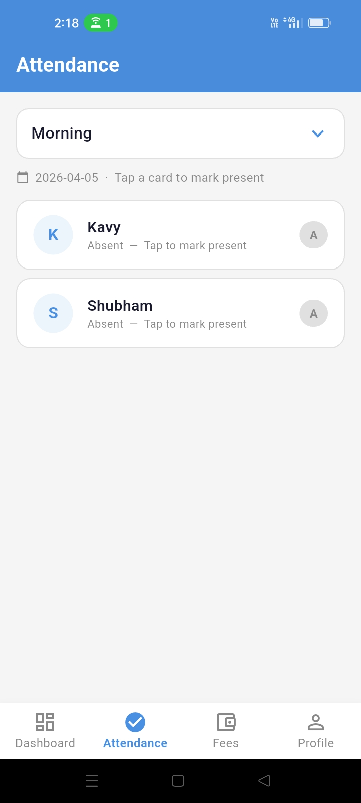
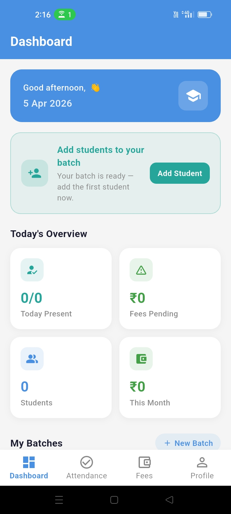
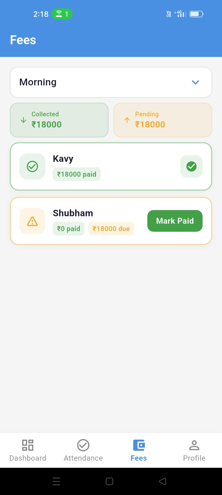
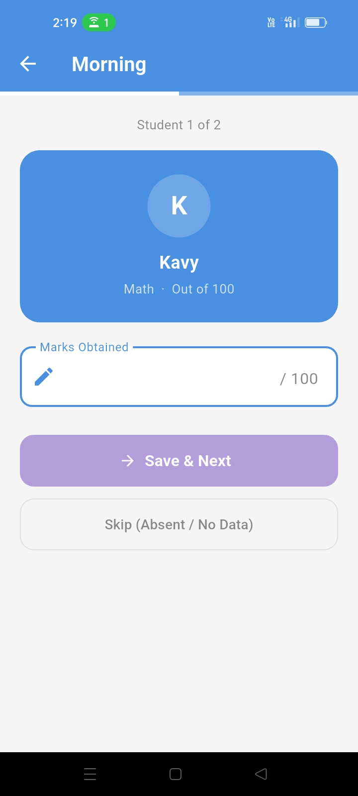

# 📚 Stidfy

A production-grade **Flutter** mobile application for private tutors and coaching institute teachers to manage their classes end-to-end — student enrollment, daily attendance, fee tracking, test marks, and analytics — all backed by **Firebase** and built with **Material 3**.

---

## 📋 Table of Contents

- [Overview](#overview)
- [The Problem It Solves](#the-problem-it-solves)
- [Features](#features)
- [Architecture](#architecture)
- [Project Structure](#project-structure)
- [Tech Stack](#tech-stack)
- [Firestore Data Model](#firestore-data-model)
- [Screenshots](#screenshots)
- [Prerequisites](#prerequisites)
- [Installation](#installation)
- [Configuration](#configuration)
- [Security](#security)
- [Theming](#theming)
- [Contributing](#contributing)
- [License](#license)

---

## Overview

CoachFlow gives every independent teacher or small coaching institute a personal, cloud-synced digital classroom manager — accessible from their phone at any time. Each teacher gets an isolated, secure workspace in Firestore where they can create multiple batches, manage students across batches, track daily attendance on a visual calendar, record fee payments, and log test marks — all without touching a spreadsheet or paper register.

The app is locked to portrait orientation, uses a single global `AppColors` class for theming, and separates all Firestore and Auth logic into a dedicated `Backend/` layer to keep UI code clean.

---

## The Problem It Solves

Running a private tuition class or small coaching institute involves far more administrative work than most people expect — and almost all of it is done manually.

### Without CoachFlow, teachers typically:

- **Maintain paper attendance registers** that get damaged, go missing, or become impossible to search when a parent asks about their child's record from 3 months ago.
- **Track fees in notebooks or WhatsApp messages** — leading to disputes over who paid, when they paid, and how much is still outstanding, especially when managing 30–80 students across multiple batches.
- **Have no historical performance view** — there is no easy way to look at a student's attendance percentage over a month or compare test scores across exams.
- **Struggle with multi-batch chaos** — a teacher running "Grade 10 Maths – Morning," "Grade 12 Physics – Evening," and "JEE Drop Year – Weekend" simultaneously has completely different schedules, fees, and student rosters that don't fit any single paper system cleanly.
- **Waste evenings on admin** — time that should go toward lesson preparation instead goes toward totalling attendance and sending fee reminder messages one by one.

### How CoachFlow fixes this:

- **Attendance** is marked in seconds per batch, stored permanently in Firestore, and visualised as a colour-coded monthly calendar per student — green for present, red for absent, grey for non-class days.
- **Fees** are tracked automatically. The app knows each student's `fees_due`, `fees_paid`, and the last month they paid — so unpaid dues surface immediately without any manual calculation.
- **Batches** are first-class objects with their own schedules, monthly fees, start dates, and durations — the app computes total expected fees automatically.
- **Test marks** are recorded per batch per exam and stored against each student for future reference.
- **Analytics** on the Dashboard give a real-time overview across all active batches without any manual tallying.

---

## Features

### 🔐 Authentication
- Email/password sign-up and login via **Firebase Authentication**.
- Each teacher's data is fully isolated in Firestore under their own `uid`.
- **Persistent login** — `StreamBuilder` on `authStateChanges()` keeps the session alive across app restarts with a loading splash while Firebase resolves the auth state.
- Graceful Firebase error messages surfaced as snackbars (e.g. wrong password, email already in use).

### 🏠 Dashboard
- **Personalised greeting banner** with time-aware message (Good morning / afternoon / evening) and today's date.
- **Today's Overview** — live analytics grid built on real-time Firestore streams.
- **Next Action Card** — contextual guide that detects the teacher's current state and surfaces the most relevant next step (e.g. "No batches yet — create one", "Batch has no students — add one", "Mark today's attendance").
- **Batch cards** with subject, schedule, monthly fee, start date, duration, and computed total fee.
- **Quick Actions panel** — one-tap shortcuts to Add Student, Mark Attendance, Record Payment, Create Batch, and Add Test Marks.
- **Onboarding guide** for first-time users — step-by-step cards to create a batch then add students, shown only when no batches exist.

### 📦 Batch Management
- Create batches with: name, subject, weekly schedule (e.g. Mon/Wed/Fri), monthly fee, start date, and total duration in months.
- **Computed total fee** displayed on each batch card (`monthly fee × duration months`).
- Delete batches directly from the batch card.
- **Real-time Firestore stream** — all batch changes reflect instantly without manual refreshes.

### 👩‍🎓 Student Management
- Add students to a specific batch with: name, parent email, parent phone, roll number, and initial fees due.
- **Deactivate students** (soft delete — all historical data including attendance and payments is preserved).
- Per-student detail screen with full profile, attendance calendar, attendance percentage ring, and payment history.
- Students are scoped per batch — the batch list drives the student list.

### ✅ Attendance
- Mark attendance (present / absent) per student per date with a single tap.
- **Visual attendance calendar** — full monthly grid with colour-coded cells:
  - 🟢 **Green with a tick** — present on a scheduled class day.
  - 🔴 **Red with a diagonal cross** — absent on a scheduled class day.
  - ⬜ **Light grey** — non-class day (based on the batch's weekly schedule).
  - 🔘 **Muted grey** — future dates (no action possible yet).
- **Schedule-aware logic** — only days matching the batch's configured weekly days are treated as class days. All other days show as non-class days rather than absences.
- **Attendance percentage ring** (`_CircularPercentage`) shown per student — a circular progress indicator overlaid with the percentage number.
- Navigate between months using previous/next controls on the calendar header.

### 💰 Fee Management
- Track `fees_due` and `fees_paid` per student in real time.
- **Record payments** — each payment is written to a dedicated `payments` sub-collection with a timestamp and the paying student's reference.
- **Mark monthly fee as paid** — sets `fees_due` to 0 and records the current month as `last_fee_paid_month`.
- **Monthly fee reset logic** — fees are only re-applied for the new month if the current month has not yet been marked as paid, preventing double-billing.
- All outstanding dues surface immediately in the Fees tab — no manual calculation needed.

### 📝 Test Marks
- **Batch-first flow** — teacher selects a batch, then enters marks for each student in a single scrollable form.
- Marks are stored per student and accessible in the student detail screen for historical review.

### 📊 Analytics
- Real-time counters aggregated from Firestore across all batches: active students, total batches, attendance marked today, fees collected this month.
- All analytics widgets use `StreamBuilder` directly — no intermediate state layer needed.

### 👤 Profile
- Displays teacher name and email pulled from Firestore.
- Sign-out button available in the AppBar on the Profile tab.

---

## Architecture

```
Firebase Authentication
        │  (authStateChanges stream)
        ▼
CoachFlowApp  ─── MaterialApp (Material 3, AppColors theme)
        │
        ├── AuthScreen ─────────────────────────── Login / Register
        │       │
        │       └── AuthServices (AuthManager.dart)
        │               ├── createUserWithEmailAndPassword()
        │               ├── signInWithEmailAndPassword()
        │               └── signOut()
        │
        └── MainDashboard (Scaffold + IndexedStack + BottomNavigationBar)
                │
                ├── [0] DashboardScreen
                │       ├── StreamBuilder → teachers/{uid}/batches
                │       ├── _buildGreetingBanner()
                │       ├── _NextActionCard        ← contextual onboarding
                │       ├── _buildAnalyticsGrid()
                │       ├── _BatchCard list
                │       └── _QuickActionPanel
                │
                ├── [1] AttendanceScreen
                │       ├── StreamBuilder → batches (selector)
                │       ├── StreamBuilder → students (filtered by batch)
                │       ├── Mark present/absent → DatabaseHelper.markAttendance()
                │       └── _AttendanceCalendar (month grid, schedule-aware)
                │
                ├── [2] PaymentScreen
                │       ├── StreamBuilder → students (fees_due, fees_paid)
                │       ├── Record payment → DatabaseHelper.addPayment()
                │       └── Mark monthly paid → DatabaseHelper.markMonthlyPaid()
                │
                └── [3] ProfileScreen
                        └── FirebaseAuth.signOut()

Push-navigated screens (own Scaffold + AppBar):
  AddBatch                  → DatabaseHelper.addBatch()
  AddStudents               → DatabaseHelper.addStudent()
  SelectBatchForTestScreen
    └── AddTestMarks        → Firestore (marks sub-collection)
  StudentDetailScreen
    ├── _AttendanceCalendar (month grid)
    ├── _CircularPercentage (attendance ring)
    └── Payment history list

Backend Layer (Backend/):
  AuthManager.dart          — Firebase Auth wrapper (signUp, signIn, signOut)
  database_helper.dart      — All Firestore CRUD (batches, students,
                               attendance, fees, payments, marks)
```

---

## Project Structure

```
lib/
├── main.dart                   # All UI screens, widgets, AppColors, app entry point
│
Backend/
├── AuthManager.dart            # Firebase Auth: signUp, signIn, signOut
└── database_helper.dart        # Firestore CRUD: batches, students,
                                #   attendance, fees, payments, test marks
```

The project follows a strict two-layer architecture:

- **UI layer** (`main.dart`) — all widgets, layouts, screen logic, and navigation. Every UI-specific block is annotated with a `// UI:` comment.
- **Backend layer** (`Backend/`) — all Firestore reads/writes and Firebase Auth calls. Every data operation is annotated with `// Backend:`. To change any data behaviour, only edit files here.

> Colour changes → edit `AppColors` only.
> Firestore changes → edit `DatabaseHelper` only.

---

## Tech Stack

| Layer | Technology |
|---|---|
| Framework | Flutter (Material 3) |
| Language | Dart |
| Authentication | Firebase Authentication (email/password) |
| Database | Cloud Firestore (NoSQL, real-time streams) |
| State Management | `StreamBuilder` + `setState` (reactive Firestore streams) |
| Navigation | `Navigator.push` + `IndexedStack` bottom nav |
| Orientation lock | `SystemChrome.setPreferredOrientations` (portrait only) |
| Architecture | Feature-based UI with a separated Backend helper layer |

---

## Firestore Data Model

```
teachers/
  {teacherId}/
    ├── name                        (String)
    ├── email                       (String)
    ├── created_at                  (Timestamp)
    │
    ├── batches/
    │     {batchId}/
    │       ├── name                (String)
    │       ├── subject             (String)
    │       ├── schedule            (String)    e.g. "Mon, Wed, Fri"
    │       ├── monthly_fee         (double)
    │       ├── start_date          (Timestamp)
    │       ├── duration_months     (int)
    │       ├── total_days          (int)
    │       └── last_attendance_date (Timestamp | null)
    │
    ├── students/
    │     {studentId}/
    │       ├── name                (String)
    │       ├── parent_email        (String)
    │       ├── parent_phone        (String)
    │       ├── batch_id            (String)    → ref batches/{batchId}
    │       ├── roll_no             (String)
    │       ├── join_date           (Timestamp)
    │       ├── fees_due            (double)
    │       ├── fees_paid           (double)
    │       ├── last_fee_paid_month (String)    e.g. "2025-6"
    │       ├── present_days        (int)
    │       ├── last_marked_date    (Timestamp | null)
    │       ├── is_active           (bool)
    │       ├── created_at          (Timestamp)
    │       │
    │       └── attendance/
    │             {dateISO}/        e.g. "2025-06-14T00:00:00.000"
    │               ├── date        (Timestamp)
    │               └── present     (bool)
    │
    └── payments/
          {paymentId}/
            ├── student_id          (String)    → ref students/{studentId}
            ├── amount              (double)
            └── paid_on             (Timestamp)
```

---

## Screenshots

<table align="center">
  <tr>
    <td align="center">
      <b>Attendence Sheet</b><br>
      
    </td>
    <td align="center">
      <b>Dashboard</b><br>
      
    </td>
  </tr>
  <tr>
    <td align="center">
      <b>Fees Status</b><br>
      
    </td>
    <td align="center">
      <b>Add Marks</b><br>
      
    </td>
  </tr>
</table>

---

## Prerequisites

- **Flutter SDK** ≥ 3.0 ([install guide](https://docs.flutter.dev/get-started/install))
- **Dart** ≥ 3.0 (bundled with Flutter)
- A **Firebase project** with Authentication and Firestore enabled
- **FlutterFire CLI** for automatic `firebase_options.dart` generation
- An Android or iOS device / emulator

---

## Installation

### 1. Clone the repository

```bash
git clone https://github.com/your-username/coachflow.git
cd coachflow
```

### 2. Install Flutter dependencies

```bash
flutter pub get
```

### 3. Connect Firebase

Install the FlutterFire CLI:

```bash
dart pub global activate flutterfire_cli
```

Run the configuration wizard — this auto-generates `lib/firebase_options.dart`:

```bash
flutterfire configure
```

> ⚠️ **Never commit `firebase_options.dart`, `google-services.json`, or `GoogleService-Info.plist` to a public repository.** Add them to `.gitignore`.

### 4. Enable Firebase services

In the [Firebase Console](https://console.firebase.google.com):

- **Authentication → Sign-in method** → Enable **Email/Password**.
- **Firestore Database** → Create a database in **Production mode**, then apply the security rules below.

### 5. Apply Firestore Security Rules

In **Firestore → Rules**, paste the following:

```js
rules_version = '2';
service cloud.firestore {
  match /databases/{database}/documents {
    match /teachers/{teacherId}/{document=**} {
      allow read, write: if request.auth != null
                         && request.auth.uid == teacherId;
    }
  }
}
```

This ensures each teacher can only access their own data — no cross-tenant reads or writes are possible.

### 6. Run the app

```bash
flutter run
```

---

## Configuration

### `pubspec.yaml` — required dependencies

```yaml
dependencies:
  flutter:
    sdk: flutter
  firebase_core: ^3.0.0
  firebase_auth: ^5.0.0
  cloud_firestore: ^5.0.0
```

Run `flutter pub get` after editing `pubspec.yaml`.

### Android — `android/app/build.gradle`

Ensure `minSdkVersion` is at least **21**:

```gradle
android {
    defaultConfig {
        minSdkVersion 21
    }
}
```

### iOS — `ios/Podfile`

Set the platform to at least **iOS 13**:

```ruby
platform :ios, '13.0'
```

---

## Security

### Authentication
- All sessions are managed by **Firebase Authentication**.
- The app uses a `StreamBuilder` on `authStateChanges()` as the auth gate — unauthenticated users can never reach the dashboard regardless of navigation.
- Firebase ID tokens are rotated automatically by the SDK.

### Data Isolation
- Every Firestore read and write is scoped to the authenticated teacher's `uid` at the rules level.
- `DatabaseHelper` always reads `FirebaseAuth.instance.currentUser!.uid` at the time of each operation — there is no stored or cached uid that could be tampered with.

### Input Validation
- All form fields validate for empty inputs before any Firestore write is attempted.
- `FirebaseAuthException` messages are caught and surfaced to the user as snackbars rather than crashing silently.

---

## Theming

All colours are defined in a single `AppColors` class at the top of `main.dart`. To retheme the entire app, only change values here — no colour is hardcoded anywhere else in the widget tree.

```dart
class AppColors {
  AppColors._();                            // non-instantiable utility class

  // Backgrounds
  static const background = Color(0xFFF5F5F5);
  static const card       = Color(0xFFFFFFFF);

  // Brand
  static const primary    = Color(0xFF4A90E2);

  // Semantic
  static const success    = Color(0xFF43A047);
  static const warning    = Color(0xFFF5A623);
  static const error      = Color(0xFFE53935);

  // Text
  static const textPrimary   = Color(0xFF1A1A2E);
  static const textSecondary = Color(0xFF888888);

  // Accents
  static const lavender = Color(0xFFB39DDB);
  static const teal     = Color(0xFF26A69A);
}
```

The `colorScheme` in `MaterialApp` is seeded from `AppColors.primary`, so all Material 3 system colours (ripples, focus rings, state layers) also update automatically when you change the primary.

---

## Contributing

Pull requests are welcome. For major changes, please open an issue first to discuss what you'd like to change.

1. Fork the repository and create your feature branch:
   ```bash
   git checkout -b feature/your-feature-name
   ```
2. Follow the existing architecture convention:
   - All UI code belongs in `main.dart` — annotate with `// UI:`
   - All Firestore / Auth operations belong in `Backend/` — annotate with `// Backend:`
   - Never hardcode colours — always reference `AppColors`
   - Never add Firestore logic directly inside a widget's `build` method — route it through `DatabaseHelper`
3. Commit your changes:
   ```bash
   git commit -m "feat: describe your change"
   ```
4. Push and open a Pull Request:
   ```bash
   git push origin feature/your-feature-name
   ```

---

## License

This project is licensed under the MIT License. See the [LICENSE](LICENSE) file for details.

---

## Acknowledgements

Built with [Flutter](https://flutter.dev) and [Firebase](https://firebase.google.com).
